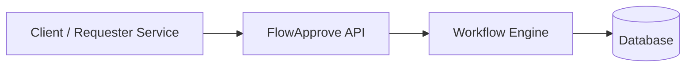
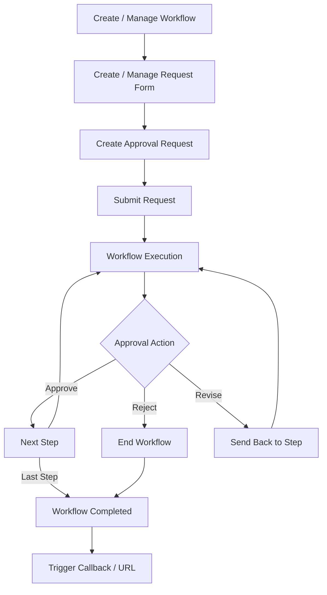

# Project Name

FlowApprove is a lightweight backend service for configurable approval workflows. It supports step-based approvals, role-based approvers, and conditional rules without hardcoded logic. Designed to be domain-agnostic and easy to integrate into various business processes.

## Overview

FlowApprove is a lightweight backend service for handling approval workflows in a simple and flexible way ✨  
It supports both **dynamic approvers** (like a requester’s direct manager) and **fixed approvers**, without hardcoding rules.

A single workflow can be reused across different request forms, while every action—**approve, reject, or revise**—is fully tracked so you always know what happened and who’s next 🔄  
When a workflow is completed, FlowApprove can notify other systems via **callback or URL**, making it easy to deploy and use right away 🔌🚀

## Goals

- Provide a **simple and flexible approval workflow backend** 🚦  
- Support **dynamic approvers** (e.g. direct manager) and **fixed approvers**  
- Allow **one workflow to be reused** across different request forms  
- Track **approve, reject, and revise actions** with a **clear approval history** 🕒  
- Enable **easy integration** with other systems via **callback or URL** 🔌  
- Be **lightweight, easy to deploy, and ready to use out of the box** ⚡  

## Non-Goals

- Building a **full UI or frontend application**  
- Handling **authentication or user management** in depth  
- Supporting **complex BPM engines or visual workflow designers**  
- Managing **notifications** (email, chat, etc.)  
- Implementing **e-signature** (planned for future extension ✍️)  
- Covering **every possible business scenario**

## High-Level Architecture

FlowApprove is a **standalone backend API** that acts as an approval workflow engine.  
External systems send requests to FlowApprove, which handles workflow execution, approver resolution, and approval history.  
Once a workflow is completed, FlowApprove notifies the caller via **callback or URL**, while the final business action is handled outside the system.

The architecture is kept **simple, lightweight, and easy to deploy**, making it suitable for internal tools and SaaS backends.

## Workflow / Process Flow

- **Workflow Management**
  - Create workflow (define steps, approver type, order)
  - Update workflow (change steps or approvers)
  - Delete workflow (only if not in use)
  - Enable / disable workflow
- **Request Form Management**
  - Create request form (define data fields)
  - Update request form
  - Delete request form
  - Assign workflow to request form
- **Approval Request Lifecycle**
  - Create approval request from a form
  - Update request data (before approval starts)
  - Submit request to start workflow
  - Cancel request (before completion)
- **Approval Actions**
  - Approve current step
  - Reject request
  - Revise and send back to a specific step or person
  - Add comment or reason for each action
- **Workflow Execution**
  - Resolve approver (dynamic or fixed)
  - Move to next step based on action
  - Skip step when condition is not met
  - Detect workflow completion
- **Tracking & History**
  - Record every approval action
  - Track current step and next approver
  - View full approval timeline
- **Completion & Integration**
  - Mark request as approved or rejected
  - Trigger callback or redirect URL
  - Send final workflow result to external systems

## Core Concepts

- **Workflow**
  - Defines the approval steps and order
  - Independent from request forms
  - Reusable across different request types
- **Step**
  - Represents a single approval stage
  - Does not point to a specific user directly
  - Uses rules to resolve who should approve
- **Approver**
  - Can be dynamic (e.g. direct manager)
  - Can be fixed (specific user or role)
  - Resolved at runtime
- **Request Form**
  - Defines the data structure of a request
  - Can be linked to a workflow
  - Does not contain approval logic
- **Approval Request**
  - An instance created from a form
  - Moves through workflow steps
  - Has a clear current state
- **Approval Action**
  - Actions taken by an approver
  - Includes approve, reject, and revise
  - Always recorded as history
- **Approval History**
  - Immutable record of all actions
  - Shows who did what and when
  - Explains how the request reached its current state
- **Workflow Completion**
  - Occurs when the last step is finished or rejected
  - Triggers callback or redirect URL
  - Final business action is handled outside the system

## Tech Stack

- **Backend Framework**
  - .NET 10 Web API (ASP.NET Core)
- **Database**
  - PostgreSQL
- **ORM**
  - Entity Framework Core
- **Containerization**
  - Docker
  - Docker Compose

## Scalability & Future Improvements

- **Scalability**
  - Scale API horizontally using stateless design
  - Use database indexing to support growing approval history
  - Introduce caching for workflow definitions if needed
- **Workflow Enhancements**
  - Support more complex conditions between steps
  - Add parallel approval steps
  - Improve step skip and rollback logic
- **Integration & Reliability**
  - Retry mechanism for callbacks
  - Support multiple callback endpoints
  - Add webhook signature verification
- **Security & Access Control**
  - Fine-grained permission control per workflow and step
  - Better audit and access visibility
- **Future Features**
  - E-signature integration ✍️
  - Notification integration (email, chat, etc.)
  - Versioning for workflows and request forms

## Design Decisions

- **Workflow is separated from request forms**
  - To allow the same workflow to be reused across different request types
  - To avoid coupling approval logic with request data
- **Steps resolve approvers at runtime**
  - To support both dynamic and fixed approvers
  - To keep workflows flexible without hardcoding users
- **Approval history is immutable**
  - To ensure traceability and auditability
  - To clearly explain how a request reached its current state
- **The system focuses on workflow execution only**
  - Final business actions are handled by external systems
  - Keeps the service lightweight and easy to integrate
- **Simple architecture over complex BPM**
  - Avoids heavy workflow engines and visual designers
  - Prioritizes clarity, maintainability, and fast deployment
- **Single deployable service**
  - Easier to operate and reason about
  - Suitable for internal tools and small-to-medium scale systems

## License

This project is licensed under the MIT License.  
You are free to use, modify, and distribute this project for both personal and commercial purposes.